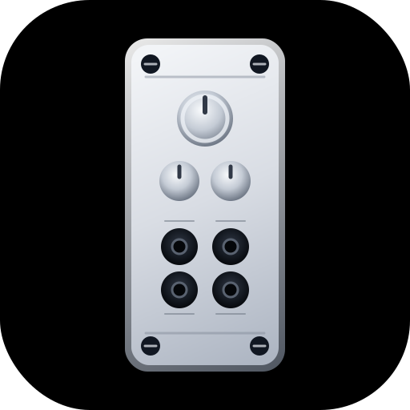

# EurorackForge

<p align="center">
  
</p>

<p align="center">
  <strong>A FreeCAD workbench for designing Eurorack front panels.</strong>
</p>

<p align="center">
  
  
</p>

## What it does

EurorackForge is a FreeCAD workbench for building Eurorack panel geometry directly inside FreeCAD.

It is focused on fast panel creation, previewing, and export. The current workflow covers:

- Creating Eurorack faceplates from presets or custom dimensions
- Previewing the panel layout before creation
- Saving and reusing panel presets
- Exporting the selected panel to STL, SVG, PNG, or KiCad DXF
- Optionally creating a matching PCB geometry behind the faceplate
- Exporting a second `_pcb.dxf` file when PCB creation is enabled

## Included panel types

EurorackForge can generate:

- Doepfer Eurorack
- Intellijel 1U
- Pulp Logic 1U
- Kosmo / LMNC
- Custom panels

For the supported standards, the workbench builds the panel dimensions and hole layout for you.

## Main workflow

1. Open the **Eurorack Forge** workbench.
2. Click **Create Faceplate**.
3. Choose the panel type and set the dimensions or HP value.
4. Optionally enable **Create PCB behind faceplate**.
5. Create the panel.
6. Select the resulting body in the tree.
7. Use **Export Panel** to write the output file.

## Faceplate creation

The faceplate task panel provides:

- A live 2D preview
- A layout summary
- Preset save / load / delete support
- Standard-specific defaults
- A Doepfer width basis switch for mathematical or published actual widths
- Custom width, height, thickness, and hole settings
- Optional PCB generation behind the faceplate

The preview is meant to stay usable on smaller screens, and the task panel now scales better than before.

## Export options

The export dialog currently supports:

| Format | Result |
| --- | --- |
| STL | 3D mesh export of the selected body |
| SVG | Vector export of the selected panel shape |
| PNG | Rendered image of the current view |
| KiCad DXF | Draft-based 2D export of the faceplate |

### KiCad DXF export

The KiCad DXF export follows the same Draft workflow as the manual FreeCAD steps:

1. Create a `Shape2DView`
2. Export that 2D result as DXF

When PCB creation is enabled, EurorackForge also writes a second DXF file for the PCB:

- `panel.dxf`
- `panel_pcb.dxf`

The PCB DXF is generated directly in Python as a simple closed outline, which keeps it predictable and easy to import into KiCad or Adobe tools.
The PCB outline uses a fixed 100 mm height and a width derived from the panel HP or custom panel width.

## File naming

The export dialog includes a dedicated **Export name** field next to the selected object and type.

Behavior:

- The default export name is based on the FreeCAD document filename
- The chosen export folder is remembered
- Export refuses to overwrite an existing file

## Installation

### Via FreeCAD Addon Manager

1. Open FreeCAD.
2. Go to **Tools > Addon Manager**.
3. Add this repository as a custom repository if needed.
4. Install **EurorackForge**.
5. Restart FreeCAD if necessary.

Repository URL:

```text
https://github.com/nathanaelnoir/EurorackForge
```

### Manual install

Copy these files into your FreeCAD macro/workbench directory:

- `EurorackForge.FCMacro`
- `EurorackForge.svg`

After installation, the workbench is available as **Eurorack Forge**.

## Commands

The workbench exposes two main commands:

- **Create Faceplate**
- **Export Panel**

They are available from the toolbar, menu, and context menu.

## Notes

- The panel generator is centered around the model origin.
- The exporter expects you to select the panel body or the generated panel object in the tree.
- KiCad DXF export is intended for panel outline workflows and companion PCB outlines.
- The workbench keeps a macro wrapper for compatibility, but the main experience is the FreeCAD workbench itself.

## Troubleshooting

### The export file already exists

EurorackForge now stops instead of overwriting existing files. Choose a different name or folder.

### The PCB DXF looks wrong

Make sure PCB creation was enabled when the panel was generated. The PCB file is written from the panel spec, not from a projected solid.

### The panel preview looks clipped

The faceplate task panel resizes itself for smaller screens, but very small displays may still benefit from a taller window or a scrollable layout.

## Repository files

- `EurorackForge.py` - main workbench code
- `InitGui.py` - FreeCAD workbench registration
- `EurorackForge.FCMacro` - compatibility macro wrapper
- `EurorackForge.svg` - workbench icon
- `EurorackForgeExport.svg` - export icon
- `package.xml` - Addon Manager metadata
- `LICENSE.md` - MIT license

## License

MIT License. See [LICENSE.md](LICENSE.md).
